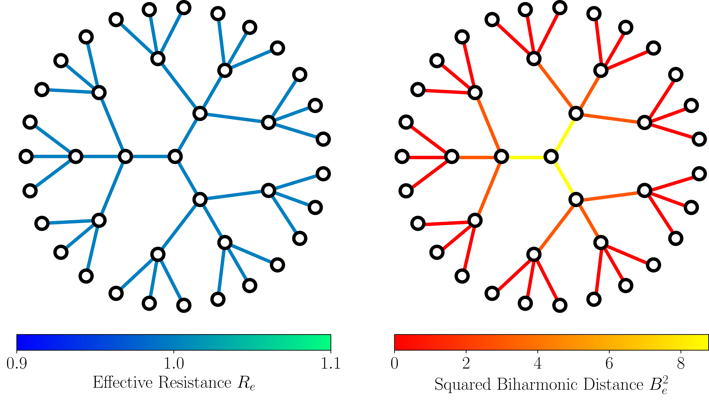

# Biharmonic Distance of Graphs and its Higher-Order Variants: Theoretical Properties with Applications to Centrality and Clustering

This repository contains the code for the ICML 2024 paper "Biharmonic Distance of Graphs and its Higher-Order Variants: Theoretical Properties with Applications to Centrality and Clustering" 

